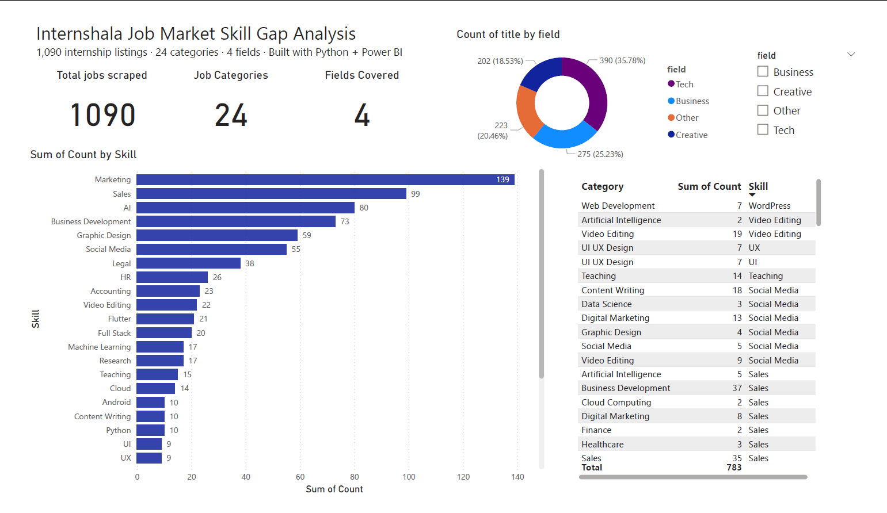
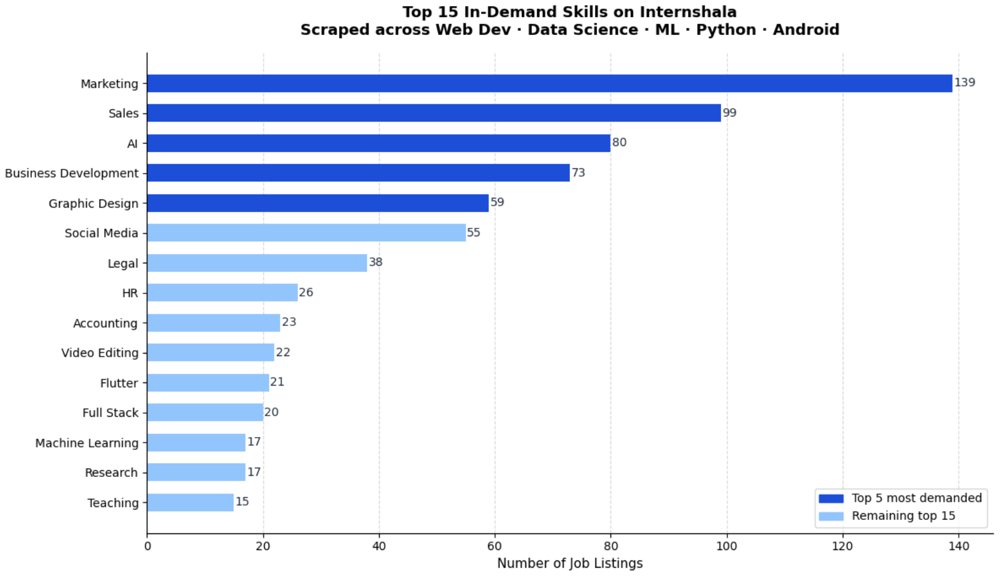
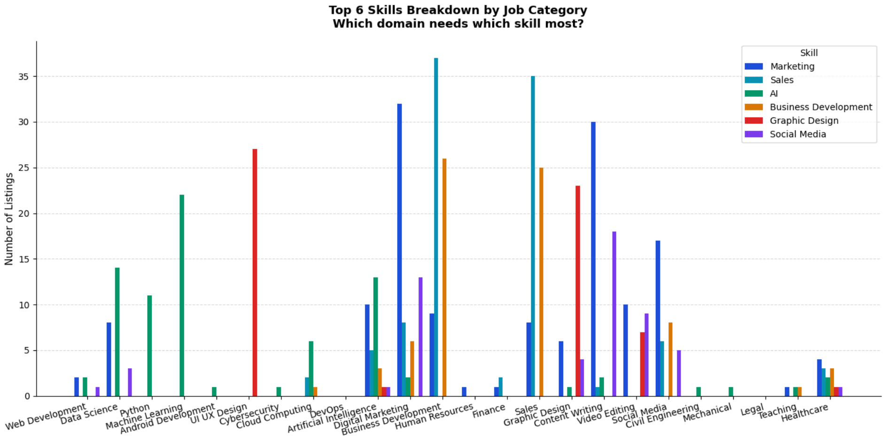
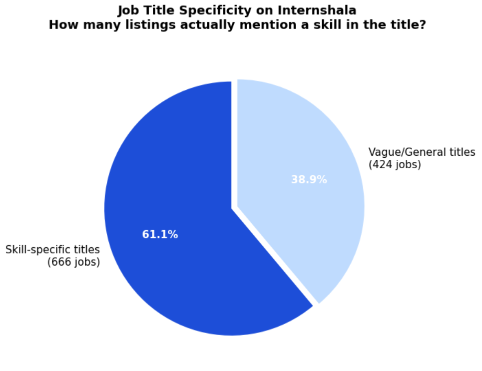

# 📊 Internshala Job Market Skill Gap Analyser

> **A Python-powered data analytics project** that scrapes 1,090+ internship listings from Internshala across 24 job categories to uncover which skills are most in-demand — and where the gaps are for freshers in India.

---

## 🔍 The Question This Project Answers

*"As a fresher in India, which skills should I actually learn — and do job listings even tell you that clearly?"*

I scraped real, live data from Internshala across tech, business, creative, and engineering domains to find out.

---

## 💡 Key Findings

| # | Finding |
|---|---------|
| 1 | **AI skills appear in 15 out of 24 job categories** — including non-tech domains like Legal, Civil Engineering, and Healthcare. It is the most cross-domain skill on the platform. |
| 2 | **Marketing appears in 14 categories** — even technical roles like Cloud Computing and Data Science expect business awareness. |
| 3 | **38.9% of job titles are vague** — companies write "Web Development Intern" with no specific skill mentioned, making description-level scraping a necessary next step. |
| 4 | **Flutter dominates Android listings** — appearing in 21 of 51 Android job titles, far ahead of native Android (10). Companies want cross-platform, not just native. |
| 5 | **Full Stack, Python, and Machine Learning appear across 3+ domains** — making them the safest skills for freshers to prioritise regardless of domain. |

---

## 📈 Dashboard & Charts

### Power BI Interactive Dashboard
> Filter by field (Tech / Business / Creative / Other) — all visuals update instantly via cross-filtering.



### Top 20 In-Demand Skills


### Skills Breakdown by Category


### Job Title Specificity


---

## 🗂️ Dataset

| Metric | Value |
|--------|-------|
| Total jobs scraped | 1,090 |
| Job categories | 24 |
| Fields covered | Tech · Business · Creative · Other |
| Unique skills tracked | 42 |
| Source | Internshala.com (live scrape) |

**Categories include:** Web Development, Data Science, Machine Learning, Android, UI/UX, Cybersecurity, Cloud Computing, DevOps, AI, Digital Marketing, Business Development, HR, Finance, Sales, Graphic Design, Content Writing, Video Editing, Social Media, Civil Engineering, Mechanical, Legal, Teaching, Healthcare

---

## 🛠️ Tools & Technologies

| Tool | Purpose |
|------|---------|
| Python | Core language |
| requests + BeautifulSoup | Web scraping live Internshala pages |
| pandas | Data cleaning, filtering, aggregation |
| regex | Skill keyword pattern matching |
| matplotlib | Static charts (bar, pie) |
| Plotly | Interactive charts with hover & zoom |
| Power BI | Interactive dashboard with cross-filtering |
| Google Colab | Development environment |
| GitHub | Version control |

---

## 📁 Project Structure

```
job-market-skill-gap/
│
├── job_market_skill_gap_analyzer.ipynb   ← main notebook (run this)
│
├── data/
│   ├── internshala_jobs.csv              ← 1,090 scraped job listings
│   ├── skill_counts.csv                  ← top 30 skills with counts
│   ├── category_skills.csv               ← top skills per category
│   └── field_summary.csv                 ← field-level summary stats
│
├── charts/
│   ├── chart1_top_skills.png
│   ├── chart2_skills_by_category.png
│   └── chart3_vagueness.png
│
├── dashboard/
│   ├── internshala_dashboard.pbix        ← Power BI file
│   ├── dashboard_preview.png             ← screenshot
│   └── dashboard.pdf                     ← exported PDF
│
└── README.md
```

---

## 🚀 How to Run

### Option 1 — Google Colab (easiest)
1. Click **Open in Colab** badge at top of notebook
2. Run **Cell 1** (pip install) → wait for libraries to install
3. Run **Cell 2** (master scraper) → takes ~3 minutes, scrapes all 24 categories
4. Run remaining cells top to bottom
5. Charts auto-save as PNG files, CSVs auto-download

### Option 2 — Local
```bash
git clone https://github.com/Siya-Tambe/job-market-skill-gap.git
cd job-market-skill-gap
pip install requests beautifulsoup4 pandas matplotlib plotly
jupyter notebook job_market_skill_gap_analyzer.ipynb
```
---

## 🧠 What I Learned

This was my first end-to-end data analytics project, built while learning Python basics. Key things I picked up:

- How web scraping works (HTTP requests, HTML parsing, handling dynamic pages)
- Real-world data is messy — 38.9% of titles gave us nothing useful
- The difference between data that looks right and data that is right (debugging regex bugs)
- How to structure a project so it's reproducible (master setup cell, clean imports)
- How to turn numbers into a story someone actually wants to read

---

## 👩‍💻 About

**Siya Tambe** — Second year CS student based in Pune, India.

Building projects to learn data analytics from scratch.

[](https://www.linkedin.com/in/siya-tambe-7375b7378/)
[](https://github.com/Siya-Tambe)

---

*Data scraped in April 2026. Results reflect listings available at time of scraping.*
